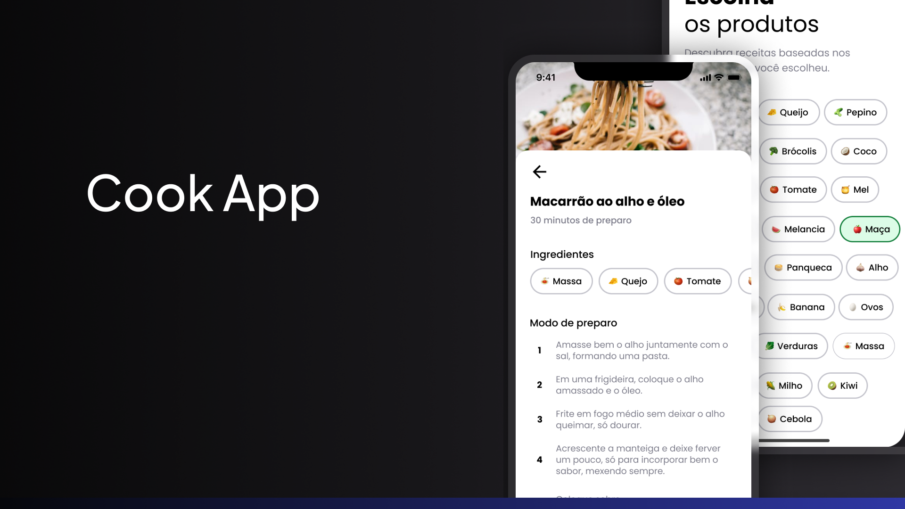

<h1 align="center">
Cook App - Receitas Rápidas com os Ingredientes que Você Tem
</h1>

<h1 align="center">
  
</h1>

O Cook App é uma aplicação desenvolvida em React Native que ajuda a resolver o dilema de muitas pessoas: o que cozinhar quando você está com fome, mas não tem muitos ingredientes em casa. Com o Cook App, você pode receber sugestões de receitas com base nos ingredientes que já possui na sua despensa.

## Funcionalidades Principais

- **Sugestão de Receitas Personalizadas**: Receba sugestões de receitas com base nos ingredientes que você tem disponíveis em casa.
- **Interface Amigável**: Interface intuitiva e fácil de usar, projetada com React Native e Expo.
- **Integração com Supabase**: Armazena e recupera dados de receitas utilizando o Supabase como banco de dados.
- **Animações Suaves**: Utiliza a biblioteca React Native Reanimated para criar animações fluidas e uma experiência de usuário envolvente.

## Como Utilizar

1. **Instalação do Projeto**:
   - Clone este repositório em sua máquina local.
   - Navegue até o diretório do projeto e execute `npm install` para instalar as dependências.

2. **Execução do Projeto**:
   - Certifique-se de ter o ambiente Expo configurado em sua máquina.
   - Execute `expo start` para iniciar o servidor de desenvolvimento.

3. **Explorando o Cook App**:
   - Abra o aplicativo Expo em seu dispositivo móvel ou em um emulador.
   - Explore as diversas receitas disponíveis com base nos ingredientes que você possui.

## Tecnologias Utilizadas

- React Native
- Expo
- Expo Router
- Supabase
- React Native Reanimated

## Licença

Este projeto está licenciado sob a [MIT License](https://opensource.org/licenses/MIT).
